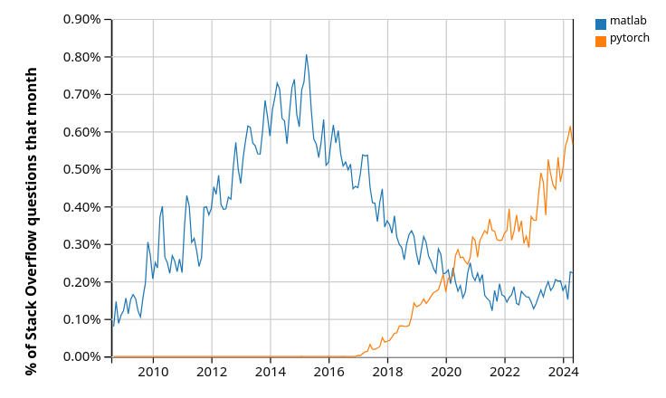

---
jupytext:
  text_representation:
    extension: .md
    format_name: myst
kernelspec:
  display_name: Python 3
  language: python
  name: python3
---

```{only} html
<div dir="rtl">
```

مقدمه ای بر پایتون

درباره ی این دوره

# برنامه نویسی پایتون برای اقتصاد و مالی

" پایتون به قدری پیشرفته و قدرتمند شده است که دیگر نیازی به استفاده از R نداریم.

طرفداران R، ببخشید؛ خود من هم زمانی یکی از شما بودم، اما دیگر به سراغ R نمی روم."

_ کریس ویگینس

مقدمه

در این مجموعه خواهید آموخت که از پایتون برای محاسبات علمی و با تمرکز بر اقتصاد و امور مالی استفاده کنید. این مجموعه برای افراد مبتدی طراحی شده است، اما افراد حرفه ای نیز محتوای مفیدی را در این دروس پیدا خواهند کرد.

در این درس:

پایتون را معرفی می کنیم

برخی از ویژگی های پایتون را نشان خواهیم داد

در رابطه با ارتباط پایتون و هوش مصنوعی بحث خواهیم کرد

توضیح می دهیم که چرا پایتون زبان محبوب ما برای محاسبات علمی است

و شما را به ادامه ی مسیر و اهدافتان تشویق می کنیم.

همچنین شما نیازی به درک همه ی مواردی که در این درس خواهید دید، ندارید؛ زیرا در ادامه ی دروس تمامی جزئیات را آموزش خواهیم داد.

# آیا نمیتوانم فقط از ChatGPT استفاده کنم؟

خیر!

شاید وسوسه انگیز به نظر برسد که در عصر هوش مصنوعی هایی مانند ChatGPT و LLM  و ابزارهایی با بهره وری فوق العاده برای برنامه نویسی، ما همچنان به یادگیری نحوه ی کد نویسی نیاز داشته باشیم.

در واقع شاید یک هوش مصنوعی بتواند همراه خوبی برای یادگیری دروس این دوره باشد؛ هوش مصنوعی مطمئنا می تواند به شما در نوشتن و ترکیب کد ها کمک کند (سعی کنید کد های این مجموعه را کپی کنید و از هوش مصنوعی بخواهید آن را برای شما توضیح دهد)؛ اما هوش مصنوعی نمی تواند سوالات جدیدی را که قبلا ندیده است به طور کامل و قابل اعتماد حل کند.

بنابراین شما نیاز خواهید داشت تا به‌ عنوان یک ناظر بتوانید کد ها رابخوانید، بنویسید و درک کنید.

# آیا Matlab بهتر نیست؟

نه! نه و هزاران بار نه! امروزه تقریبا برای اکثر مشکلات، کتابخانه های علمی پایتون قابلیت های بسیار پیشرفته تری نسبت به متلب دارند. ما مزایای استفاده از کتابخانه های پایتون را در این مجموعه و سری های بعد توضیح خواهیم داد، همچنین خواهیم گفت که چگونه طراحی زیبای پایتون به شما کمک می کند تا کدی تمیز و کارآمد بنویسید.

علاوه براین ویژگی ها، پایتون توسط یک انجمن بزرگ، کمک کننده و رایگان در حال گسترش کاربران است.

# برنامه نویسی پایتون چیست؟
پایتون یک زبان برنامه نویسی همه منظوره است که در سال 1989 توسط خیدو فان روسوم ابداع شد.

پایتون رایگان و متن باز است و توسعه ی آن از طریق بنیاد نرم افزار پایتون انجام می شود.

این موضوع مهم است زیرا:

پولمان را پس انداز می کند، به جای یک شرکت انتفاعی، توسط جامعه ی کاربران کنترل می شود و قابلیت تکثیر و علم باز را تشویق می کند.

# کاربردهای رایج پایتون

پایتون یک زبان همه منظوره است که تقریبا در همه ی حوزه های کاربردی از جمله موارد زیر استفاده می شود:

هوش مصنوعی، محاسبات علمی، ارتباطات، توسعه ی وب، CGI و رابط های کاربری گرافیکی، توسعه ی بازی، محتوای چندرسانه ای و غیره.

همچنین بطور گسترده ای توسط شرکت های زیر مورد استفاده و پشتیبانی قرار می گیرد:

Google، Open AI،Netflix ، Meta، Dropbox، Amazon، Reddit و غیره.

# جایگاه محبوبیت

بدون شک، پایتون یکی از محبوب ترین زبان های برنامه نویسی است و کتابخانه های پایتون مانند Pandas و Polars جایگزین ابزارهای آشنایی همچونExcel  و VBA هستند که به عنوان یک مهارت ضروری در زمینه های مالی و بانکی محسوب می شوند.

علاوه براین، پایتون در جامعه ی علمی - به ویژه هوش مصنوعی – بسیار محبوب است؛ نمودار زیر که با استفاده از آمارهای وبسایت استک اورفلو تهیه شده، شواهدی از این امر را نشان می دهد.

این تصویر نسبت محبوبیت یک کتابخانه ی هوش مصنوعی پایتون با نامPyTorch   به MATLAB را نشان می دهد.



نمودار نشان می دهد که با رشد سریع PyTorch محبوبیت MATLAB در حال کمرنگ شدن است. علاوه براین، PyTorch تنها یکی از هزاران کتابخانه های در دسترس پایتون برای محاسبات علمی است.

# ویژگی ها

پایتون یک زبان برنامه نویسی سطح بالا است، بدین معنی که خواندن، نوشتن و اشکال زدایی آن نسبتا آسان است و یک هسته ی زبانی مختصر دارد که به آسانی قابل یادگیری است. این هسته ی زبانی، توسط بسیاری از کتابخانه ها پشتیبانی می شود که می توانید درصورت نیاز، استفاده از آنها را یادبگیرید.

پایتون بسیار مبتدی پسند است، زیرا؛ برای دانش آموزانی که برنامه نویسی را یادمی گیرند مناسب بوده و در بسیاری از برنامه های کارشناسی و کارشناسی ارشد تدریس می شود. همچنین پایتون دارای ویژگی های دیگری همچون پشتیبانی از چندین سبک برنامه نویسی(روشی، شی گرا،کاربردی و...) است و همچنین به حای کامپایل شدن بصورت مفسری اجرا می شود.

# نحو و طراحی

یکی از دلایل محبوبیت پایتون، طراحی ساده و ظریف آن است که در ادامه نمونه های زیادی از آن خواهیم دید.

برای بهتر درک کردن این موضوع، اجازه دهید به یک مثال از زبان برنامه نویسی جاوا و پایتون نگاهی بیاندازیم.

قرار است کد جاوا یک فایل پیش فرض به نام data.csv باز کند و میانگین مقادیر را در ستون دوم محاسبه کند. طبق آنچه در زیر می بینید، حتی بدون دانستن جاوا می توانید متوجه شوید که کد طولانی و پیچیده ای است.

حال به کد پایتون برای همان دستور را ببینید، حتی اگر هنوز چیزی از پایتون نمی دانید، می توانید ببینید که کد پایتون ساده تر و خواندن آن آسان تر است. به همین علت سادگی پایتون و طراحی منظم آن است که باعث گسترش محبوبیت این زبان برنامه نویسی شده است.

(توجه: در ادامه شما نیازی به خواندن و درک کد جاوا ندارید!)

**کد برنامه نویسی جاوا**

```{only} html
</div>
```

```java
import java.io.BufferedReader;
import java.io.FileReader;
import java.io.IOException;

public class CSVReader {
    public static void main(String[] args) {
        String filePath = "data.csv"; 
        String line;
        String splitBy = ",";
        int columnIndex = 1; 
        double sum = 0;
        int count = 0;

        try (BufferedReader br = new BufferedReader(new FileReader(filePath))) {
            while ((line = br.readLine()) != null) {
                String[] values = line.split(splitBy);
                if (values.length > columnIndex) {
                    try {
                        double value = Double.parseDouble(values[columnIndex]);
                        sum += value;
                        count++;
                    } catch (NumberFormatException e) {
                        System.out.println("Skipping non-numeric value: " + values[columnIndex]);
                    }
                }
            }
        } catch (IOException e) {
            e.printStackTrace();
        }

        if (count > 0) {
            double average = sum / count;
            System.out.println("Average of the second column: " + average);
        } else {
            System.out.println("No valid numeric data found in the second column.");
        }
    }
}
```

```{only} html
<div dir="rtl">
```

**کد برنامه نویسی پایتون**


```{only} html
</div>
```

```python
import csv

total, count = 0, 0
with open("data.csv", mode='r') as file:
    reader = csv.reader(file)
    for row in reader:
        try:
            total += float(row[1])
            count += 1
        except (ValueError, IndexError):
            pass

print(f"Average: {total / count if count else 'No valid data'}")
```

```{only} html
<div dir="rtl">
```

# اتصال هوش مصنوعی

قطعا می دانید که هوش مصنوعی به سرعت در حال گسترش و پیشرفت است، مگر اینکه سالها درون غار زندگی کرده و از هرگونه تماس با دنیای مدرن اجتناب کرده باشید!

همانطور که پیش تر به آن اشاره شد، امروزه هوش مصنوعی به خوبی می تواند به شما در نوشتن کد کمک کند. بدون شک هوش مصنوعی در آینده بسیاری از وظایفی که در حال حاضر توسط انسان انجام می شود را درست مانند سایر اشکال ماشین آلات در چند قرن گذشته، برعهده خواهد گرفت. پایتون نیز نقش بزرگی را در پیشرفت هوش مصنوعی و یادگیری ماشین ایفا می کند و این بدان معناست که شرکت های فناوری، در حال سرمایه گذاری بر روی توسعه ی کتابخانه های بسیار قدرتمند پایتون هستند. بنابراین حتی اگر قصد ندارید روی هوش مصنوعی و یادگیری ماشین کار کنید، می توانید از یادگیری بهره مند شده و از برخی از این کتابخانه ها برای پروژه های خود در اقتصاد، مالی و همچنین سایر علوم استفاده کنید؛ که این دوره چگونگی این کار را توضیح خواهد داد.

# برنامه نویسی علمی با پایتون

پیش تر درباره ی اهمیت پایتون در هوش مصنوعی، یادگیری ماشین و علم داده صحبت کرده ایم. حال بیاید به نقش پایتون در سایر زمینه های محاسبات علمی نگاهی بیاندازیم.

پایتون یک بازیکن اصلی در علومی چون نجوم، شیمی، زیست شناسی محاسباتی، هواشناسی، پردازش زبان طبیعی و... است. همچنین استفاده از پایتون در اقتصاد، امور مالی و زمینه های مرتبط آن مانند تحقیق در عملیات -که قبلا تحت سلطه ی برنامه هایی چون متلب، اکسل، استتا، C و فورترن بود- درحال گسترش است.

در ادامه به طور مختصر چند نمونه از استفاده ی پایتون را برای برنامه نویسی علمی نشان می ذهیم.

# NumPy

یکی از مهم ترین بخش های محاسبات علمی کار با داده است. داده ها اغلب در ماتریس ها، بردارها و آرایه ها ذخیره می شوند و ما میتوانیم یک آرایه ی ساده از اعداد را با پایتون خالص به صورت زیر ایجاد کنیم:

```{only} html
</div>
```

```python
a = [-3.14, 0, 3.14]                    # A Python list
a
```
```
[-3.14, 0, 3.14]
```

```{only} html
<div dir="rtl">
```

این آرایه ی بسیار کوچک نشان می دهد که کار با پایتون خالص بسیار راحت است. اما وقتی می خواهیم با آرایه های بزرگتری در برنامه های واقعی کار کنیم، به کارایی بیشتر و ابزارهای بیشتری نیاز داریم. بنابراین، برای اینکار باید از کتابخانه ها برای کار با آرایه ها استفاده کنیم.

برای پایتون، مهمترین کتابخانه ی پردازش ماتریس و آرایه، کتابخانه NumPy است. به عنوان مثال بیاید یک آرایه با 100 عنصر را با NumPy بسازیم:

```{only} html
</div>
```

```python
import numpy as np                     # Load the library

a = np.linspace(-np.pi, np.pi, 100)    # Create even grid from -π to π

a
```

```
array([-3.14159265, -3.07812614, -3.01465962, -2.9511931 , -2.88772658,

-2.82426006, -2.76079354, -2.69732703, -2.63386051, -2.57039399,

-2.50692747, -2.44346095, -2.37999443, -2.31652792, -2.2530614 ,

-2.18959488, -2.12612836, -2.06266184, -1.99919533, -1.93572881,

-1.87226229, -1.80879577, -1.74532925, -1.68186273, -1.61839622,

-1.5549297 , -1.49146318, -1.42799666, -1.36453014, -1.30106362,

-1.23759711, -1.17413059, -1.11066407, -1.04719755, -0.98373103,

-0.92026451, -0.856798  , -0.79333148, -0.72986496, -0.66639844,

-0.60293192, -0.53946541, -0.47599889, -0.41253237, -0.34906585,

-0.28559933, -0.22213281, -0.1586663 , -0.09519978, -0.03173326,

0.03173326,  0.09519978,  0.1586663 ,  0.22213281,  0.28559933,

0.34906585,  0.41253237,  0.47599889,  0.53946541,  0.60293192,

0.66639844,  0.72986496,  0.79333148,  0.856798  ,  0.92026451,

0.98373103,  1.04719755,  1.11066407,  1.17413059,  1.23759711,

1.30106362,  1.36453014,  1.42799666,  1.49146318,  1.5549297 ,

1.61839622,  1.68186273,  1.74532925,  1.80879577,  1.87226229,

1.93572881,  1.99919533,  2.06266184,  2.12612836,  2.18959488,

2.2530614 ,  2.31652792,  2.37999443,  2.44346095,  2.50692747,

2.57039399,  2.63386051,  2.69732703,  2.76079354,  2.82426006,

2.88772658,  2.9511931 ,  3.01465962,  3.07812614,  3.14159265])
```

```{only} html
<div dir="rtl">
```

حالا بیاید این آرایه را با اعمال توابع تبدیل کنیم:

```{only} html
</div>
```

```python
b = np.cos(a)                      # Apply cosine to each element of a

c = np.sin(a)                      # Apply sin to each element of a
```

```{only} html
<div dir="rtl">
```

و حالا میتوانیم به راحتی حاصلضرب اسکالر b و c را بدست بیاوریم:

```{only} html
</div>
```

```python
b @ c
```
```
9.853229343548264e-16
```

```{only} html
<div dir="rtl">
```

همچنین میتوانیم با پایتون بسیاری از دستورات دیگر را انجام دهیم، مانند اینکه میانگین و واریانس آرایه ها را محاسبه کند، ماتریس بسازد و سیستم های خطی را حل کند، آرایه های تصادفی برای شبیه سازی ایجاد کند و... که جزئیات را در بخش های بعدی پوشش خواهیم داد.

# جایگزین های NumPy

درحالیکه هنوز سلطان پردازش آرایه ها در پایتون NumPy است، اما اکنون رقبای جدیدی نیز دارد؛ کتابخانه هایی مانند CuPy، PyTorch، JAX نیز انواع آرایه ها و عملیات آرایه ای را تعبیه کرده اند و می توانند بسیار سریع و کارآمد باشند. همانطور که بعدا در این مجموعه توضیح خواهیم داد؛ در واقع این کتابخانه ها در استفاده از پردازش موازی و سخت افزار سریع، بهتر هستند. با این حال، شما هنوز هم باید ابتدا NumPy را یاد بگیرید، زیرا؛ ساده تر است و یک پایه ی قوی را فراهم می کند، به طور مستقیم عملکرد کتابخانه هایی مانند JAX را گسترش می دهد و از اینرو وقتی NumPy را می شناسید، یادگیری آن را نیز آسان تر می کند.

# SciPy

کتابخانه SciPy بر روی NumPy ساخته شده است و عملکردهای اضافی را ارائه می دهد.

برای مثال بیاید حساب کنیم  جاییکه <math xmlns="http://www.w3.org/1998/Math/MathML">
  <msubsup>
    <mo data-mjx-texclass="OP">&#x222B;</mo>
    <mrow data-mjx-texclass="ORD">
      <mo>&#x2212;</mo>
      <mn>2</mn>
    </mrow>
    <mn>2</mn>
  </msubsup>
  <mi>&#x3D5;</mi>
  <mo stretchy="false">(</mo>
  <mi>z</mi>
  <mo stretchy="false">)</mo>
  <mi>d</mi>
  <mi>z</mi>
</math> توزیع نرمال استاندارد است:

```{only} html
</div>
```

```python
from scipy.stats import norm
from scipy.integrate import quad

ϕ = norm()
value, error = quad(ϕ.pdf, -2, 2) # Integrate using Gaussian quadrature
value
```
```
0.9544997361036417
```

```{only} html
<div dir="rtl">
```

کتابخانه ی SciPy شامل بسیاری از امور استاندارد کاربردی مانند جبرخطی، یکپارچه سازی، درون یابی، بهینه سازی، توزیع  ها و تکنیک های آماری و پردازش سیگنال است که بعدا در مورد آنها با جزئیات بیشتر صحبت خواهیم کرد.  

# گرافیک

نقطه ی قوت اصلی پایتون تجسم داده ها است. محبوب ترین و جامع ترین کتابخانه ی پایتون برای ایجاد شکل ها و نمودارها Matplotlib است که شامل قابلیت های ایجاد تصاویر نمودارها، هیستوگرام ها، سطوح کانتور، نمودارهای سه بعدی، نمودارهای میله ای و... بوده و می تواند خروجی ها را در قالب های مختلف مانند (PDF، PNG، EPS و...) ارائه دهد و همچنین قابلیت ادغام LaTex را نیز دارد. می تواند مثال های زیر را ببینید:


*نمونه طرح دو بعدی با حاشیه نویسی لاتکس تعبیه شده*


*نمونه طرح سه بعدی*


*نمونه طرح کانتور*


 سایر کتابخانه های گرافیکی عبارتند از Plotly، seaborn (یک رابط سطح بالا برای Matplotlib می باشد)، Altair و Bokeh .

شبکه ها و نمودارها

مطالعه ی شبکه ها و نمودارها بخش مهمی از کار علمی در اقتصاد، مالی و سایر زمینه ها است؛ به عنوان مثال، ما به مطالعه ی مواردی چون شبکه های تولید، شبکه های بانکی و موسسات مالی، شبکه های اجتماعی و... علاقه مند هستیم؛ پایتون نیز کتابخانه های زیادی برای مطالعه ی شبکه ها و نمودارها دارد. یکی از معروف ترین این کتابخانه ها NetworkX است که از جمله ویژگی های آن داشتن الگوریتم های استاندارد گراف برای تحلیل شبکه ها و فرآیندهای مربوط به نمایش نمودارها است.

در زیر نمونه ای از کد آورده شده است که یک گراف تصادفی ایجاد و رسم می کند. رنگ گره ها براساس طول کوتاه ترین مسیر از یک گره ی مرکزی مشخص تعیین می شود.

```{only} html
</div>
```

```python
import networkx as nx
import matplotlib.pyplot as plt
np.random.seed(1234)

# Generate a random graph
p = dict((i, (np.random.uniform(0, 1), np.random.uniform(0, 1)))
         for i in range(200))
g = nx.random_geometric_graph(200, 0.12, pos=p)
pos = nx.get_node_attributes(g, 'pos')

# Find node nearest the center point (0.5, 0.5)
dists = [(x - 0.5)**2 + (y - 0.5)**2 for x, y in list(pos.values())]
ncenter = np.argmin(dists)

# Plot graph, coloring by path length from central node
p = nx.single_source_shortest_path_length(g, ncenter)
plt.figure()
nx.draw_networkx_edges(g, pos, alpha=0.4)
nx.draw_networkx_nodes(g,
                       pos,
                       nodelist=list(p.keys()),
                       node_size=120, alpha=0.5,
                       node_color=list(p.values()),
                       cmap=plt.cm.jet_r)
plt.show()
```


```{only} html
<div dir="rtl">
```

# سایرکتابخانه های علمی

همانطور که پیشتر گفته شد، درواقع هزاران کتابخانه ی علمی برای پایتون وجود دارد که برخی کوچک هستند و وظایف بسیارخاصی را انجام می دهند و برخی دیگر از نظر خطوط کد و سرمایه گذاری انجام شده روی آنها توسط کدنویس ها و شرکت های فناوری، بسیار بزرگ هستند.

در اینجا فهرست کوتاهی از چند کتابخانه ی علمی مهم برای پایتون که پیشتر نگفتیم برایتان آورده ایم:

SymPy: برای جبر نمادین، از جمله محاسبه ی حد، مشتق و انتگرال

Statsmodels: برای روال های آماری

Scikit-learn: برای یادگیری ماشین

Keras: برای یادگیری ماشین

Pyro و PyStan: برای تحلیل داده های بیزی

GeoPandas: برای تحلیل داده های مکانی

Dask: برای پردازش موازی

Numba: اجرای پایتون با سرعت برابر با کدهای سطح پایین قابل اجرا توسط سخت افزار

CVXPY: برای بهینه سازی محدب

Scikit-image و OpenCV: برای پردازش و تحلیل داده های تصویری

BeautifulSoup: XML و HTML برای استخراج داده ها از فایل های 

در این مجموعه خواهیم آموخت که چگونه از بسیاری از این کتابخانه ها برای کارهای محاسباتی علمی در اقتصاد و امور مالی استفاده کنیم.

```{only} html
</div>
```