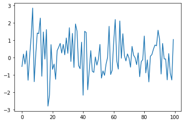

---
jupytext:
  text_representation:
    extension: .md
    format_name: myst
kernelspec:
  display_name: Python 3
  language: python
  name: python3
---

# یک مثال مقدماتی

## مقدمه

حال ما آماده ایم تا یادگیری زبان برنامه نویسی پایتون را آغاز کنیم.

در این بخش، ابتدا چند کد کوتاه پایتون می نویسیم و سپس آنها را بررسی و تحلیل می کنیم.

هدف این درس، آشنایی شما با نحو(syntax) پایه ای پایتون و ساختارهای داده ای آن است و با مباحث پیچیده تر در جلسات بعد آشنا خواهیم شد.

پیش از شروع این درس، باید جلسه ی قبل را مطالعه کرده باشید.

## هدف:رسم یک فرآیند نویز سفید
 
 فرض کنید می خواهیم یک فرآیند نویز سفید به صورت <math xmlns="http://www.w3.org/1998/Math/MathML">
  <msub>
    <mi>&#x3F5;</mi>
    <mn>0</mn>
  </msub>
  <mo>,</mo>
  <msub>
    <mi>&#x3F5;</mi>
    <mn>1</mn>
  </msub>
  <mo>,</mo>
  <mo>&#x2026;</mo>
  <mo>,</mo>
  <msub>
    <mi>&#x3F5;</mi>
    <mi>T</mi>
  </msub>
</math> ، شبیه سازی و رسم کنیم، که در آن هر <math xmlns="http://www.w3.org/1998/Math/MathML">
  <msub>
    <mi>&#x3F5;</mi>
    <mi>t</mi>
  </msub>
</math> یک مقدار مستقل و از توزیع نرمال استاندارد است.

 به بیان دیگر، می خواهیم نمودارهایی همانند نمودار زیر تولید کنیم:

 

 (در اینجا <math xmlns="http://www.w3.org/1998/Math/MathML">
  <mi>t</mi>
</math> محور افقی و <math xmlns="http://www.w3.org/1998/Math/MathML">
  <msub>
    <mi>&#x3F5;</mi>
    <mi>t</mi>
  </msub>
</math> محور عمودی است.)

ما این کار را به چند روش مختلف انجام خواهیم داد و هر بار نکات بیشتری درباره ی پایتون خواهیم آموخت.

## روش اول

در ادامه چند خط کد آمده که کاری را که تعریف کرده بودیم، انجام می دهد.

```{code-cell} ipython
import numpy as np
import matplotlib.pyplot as plt

ϵ_values = np.random.randn(100)
plt.plot(ϵ_values)
plt.show()
```
بیایید این برنامه را تجزیه و تحلیل کنیم و ببینیم چگونه کار میکند.

### Imports 

دو خط اول کد، قابلیت هایی را از کتابخانه های خارجی وارد می کند.

خط اول NumPY را وارد می کند؛ بسته ای محبوب در پایتون برای کارهایی مانند:


* کار با آرایه ها (بردارها و ماتریس ها)

* توابع ریاضی رایج مانند `cos` و `sqrt`

* تولید اعداد تصادفی

* جبر خطی و غیره.

پس از وارد کردن کتابخانه با دستور `import numpy as np`، می توانیم از طریق نحو `np.attribute` به این قابلیت ها دسترسی پیدا کنیم.

در ادامه دو مثال دیگر آورده ایم:

```{code-cell} python3
np.sqrt(4)
```

```{code-cell} python3
np.log(4)
```

#### چرا در برنامه نویسی پایتون، از Importهای متعددی استفاده می شود؟

برنامه های پایتون معمولا به چندین دستور `import` نیاز دارند.

دلیل این موضوع این است که هسته ی زبانی پایتون عمداً کوچک نگه داشته شده تا یادگیری، نگهداری و توسعه ی آن آسان باشد.

وقتی بخواهید کارهای جالب تر و پیشرفته تری با پایتون انجام دهید، تقریبا همیشه باید قابلیت های اضافی را با استفاده از `import` به برنامه اضافه کنید.

#### پکیج ها(Packages)

همانطور که پیشتر گفته شد، NumPy یک پکیج پایتونی است.

پکیج ها ابزاری هستند که توسعه دهندگان برای سازمان دهی کدی که می خواهند به اشتراک بگذارند از آن ها استفاده می کنند.

در واقع، یک **پکیج** چیزی نیست جز یک پوشه (دایرکتوری) که شامل موارد زیر است:


1. فایل هایی حاوی کد پایتون - که در اصطلاح پایتون به آن ها **ماژول** (modules)گفته می شود.

1. گاهی ممکن است شامل کدهایی کامپایل شده باشد که پایتون توانایی دسترسی به آن ها را دارد (مثلا توابعی که از زبان هایی مثل C یا FORTRAN کامپایل شده اند)

1. فایلی به نام `__init__.py` که مشخص می کند هنگامی که می نویسیم `import package_name` چه چیزی اجرا شود


می توانید با اجرای کد زیر در پایتون، محل فایل `__init__.py` مربوط به NumPY را بررسی کنید:

```{code-block} ipython
:class: no-execute

import numpy as np

print(np.__file__)
```

#### زیرپکیج ها (Subpackages)

به خط حاوی `ϵ_values = np.random.randn(100)` در کد توجه کنید.

در این دستور، `np` به پکیج NumPY اشاره دارد، و `random` یک زیرپکیج از NumPY است.

زیرپکیج ها در واقع همان پکیج هایی هستند که به صورت زیرپوشه(ساب دایرکتوری) درون یک پکیج دیگر قرار دارند.

برای مثال اگر به ساختار پکیج NumPY نگاه کنید، می توانید پوشه ای به نام `random` را درون آن پیدا کنید.

### وارد کردن مستقیم توابع یا متغیرها از یک پکیج

کدی را که پیشتر دیدیم به خاطر بیاورید

```{code-cell} python3
import numpy as np

np.sqrt(4)
```
در اینجا روش دیگری برای دسترسی به تابع جذر در NumPY آمده است.

```{code-cell} python3
from numpy import sqrt

sqrt(4)
```
این روش هم کاملا درست کار می کند.

مزیت این روش این است که اگر در کد خود از `sqrt` زیاد استفاده کنیم، در این صورت تایپ کمتری خواهیم داشت.

اما عیب آن این است که در یک کد طولانی، ممکن است این دو خط با تعداد زیادی از خطوط دیگر از هم جدا شوند.
در این صورت خوانندگان اگر بخواهند بدانند که `sqrt` از کجا آمده، برای فهمیدن منبع آن دچار مشکل خواهند شد.

### نمونه گیری تصادفی

بیاید به کدی که نویز سفید رسم می کند برگردیم. سه خط بعد از دستور Import به این صورت هستند:

```{code-cell} ipython
ϵ_values = np.random.randn(100)
plt.plot(ϵ_values)
plt.show()
```
خط اول 100 عدد نرمال استاندارد (تقریبا) مستقل تولید می کند و آن ها را در متغیر `ϵ_values` ذخیره می کند.

دو خط بعدی نمودار را رسم می کنند.

در ادامه، روش های مختلفی را بررسی خواهیم کرد تا بتوانیم این نمودار را بهتر تنظیم و بهینه سازی کنیم.

## روش های دیگر پیاده سازی برنامه

بیایید چندتا نسخه ی جایگزین برای اولین برنامه مان بنویسیم؛ برنامه ای که مقادیر تصادفی مستقل و با توزیع یکسان (IID) از توزیع نرمال استاندارد را رسم می کرد.

برنامه هایی که در ادامه می بینید، نسبت به نسخه اصلی کارایی کمتری دارند و از این نظر کمی غیرطبیعی هستند. اما آنها به ما کمک می کنند تا برخی از سینتکس ها و معانی مهم پایتون را در یک محیط آشنا نشان دهیم.

### یک نسخه با حلقه تکرار For

این نسخه حلقه های `For` و لیست های پایتون را نشان می دهد.

```{code-cell} python3
ts_length = 100
ϵ_values = []   # empty list

for i in range(ts_length):
    e = np.random.randn()
    ϵ_values.append(e)

plt.plot(ϵ_values)
plt.show()
```

به طور خلاصه:


* خط اول طول موردنظر برای سری زمانی را تعیین می کند.

* خط بعدی یک لیست خالی به نام `ϵ_values` ایجاد می کند که مقادیر تولید شده را در خود ذخیره خواهد کرد.

* عبارت `# empty list` یک توضیح (کامنت) است و توسط مفسر پایتون نادیده گرفته می شود.

* سه خط بعدی حلقه `For` هستند که به طور پیوسته یک عدد تصادفی جدید <math xmlns="http://www.w3.org/1998/Math/MathML">
  <msub>
    <mi>&#x3F5;</mi>
    <mi>t</mi>
  </msub>
</math> تولید می کنند و آنها را به انتهای لیست `ϵ_values` اضافه می کنند.

* دو خط آخر نمودار را تولید کرده و به کاربر نمایش می دهند.


بیایید برخی از بخش های این کد را با جزئیات بیشتری بررسی کنیم.

### لیست ها

دستور `ϵ_values = []` را در نظر بگیرید، این دستور یک لیست خالی ایجاد می کند.

 لیست ها یک ساختار داده داخلی در پایتون هستند که برای گروه بندی مجموعه ای از اشیا استفاده می شوند.

 همچنین لیست ها ترتیب عناصر را حفظ می کنند و اجازه وجود داده های تکراری را نیز می دهند.

برای مثال، این کد را امتحان کنید:

```{code-cell} python3
x = [10, 'foo', False]
type(x)
```

عنصر اول لیست X یک [عدد صحیح (integer)](https://en.wikipedia.org/wiki/Integer_(computer_science)) است، عنصر بعدی یک [رشته متنی (string)](https://en.wikipedia.org/wiki/String_(computer_science))، و عنصر سوم یک مقدار [بولین (Boolean value)](https://en.wikipedia.org/wiki/Boolean_data_type) می باشد.

برای اضافه کردن مقدار به لیست میتوانیم از دستور `list_name.append(some_value)` استفاده کنیم.

```{code-cell} python3
x
```

```{code-cell} python3
x.append(2.5)
x
```
در اینجا `append()` یک **متد** **(method)** محسوب می شود. متد ها توابعی هستند که به یک شیء متصل می شوند. (در اینجا به لیست X متصل شده است)

ما در ادامه به طور کامل با متدها آشنا خواهیم شد، اما برای درک اولیه:


* اشیاء پایتون مانند لیست ها، رشته ها و غیره همگی دارای متد هایی هستند که برای پردازش و تغییر داده های درون شیء استفاده می شوند.

* هر نوع شیء در پایتون متدهای مخصوص به خود را دارد، برای مثال اشیاء رشته ای دارای [متدهای مخصوص رشته ها](https://docs.python.org/3/library/stdtypes.html#string-methods) هستند ،لیست ها [متد لیستی](https://docs.python.org/3/tutorial/datastructures.html#more-on-lists) دارند.

یکی دیگر از متدهای کاربردی لیست، `pop()` است.

```{code-cell} python3
x
```

```{code-cell} python3
x.pop()
```

```{code-cell} python3
x
```

در پایتون، شماره گذاری عناصر لیست ها از صفر شروع می شود یا به عبارتی zero-based هستند.(همانند زبان های C، جاوا یا Go) به این معنا که اولین عنصر لیست با `x[0]` ارجاع داده می شود.

```{code-cell} python3
x[0]   # first element of x
```

```{code-cell} python3
x[1]   # second element of x
```

### حلقه For

حالا بیایید حلقه `for` از برنامه ای که قبلا نوشتیم را دوباره بررسی کنیم:

```{code-cell} python3
for i in range(ts_length):
    e = np.random.randn()
    ϵ_values.append(e)
```

در اینجا پایتون دو خط تورفته (indented lines) را به تعداد `ts_length` بار قبل از اینکه به ادامه کد برود، اجرا می کند.

این دو خط به عنوان یک **بلوک کد (code block)** شناخته می شوند، چرا که "بلوک" کدی را تشکیل می دهد که در حلقه تکرار می شوند.

برخلاف اکثر زبان های برنامه نویسی دیگر، پایتون محدوده بلوک را **فقط از روی تو رفتگی** تشخصی می دهد.

در برنامه ای که ما نوشته ایم، کاهش تورفتگی پس از خط `ϵ_values.append(e)` ، به پایتون می فهماند که این خط نشان دهنده انتهای بلوک کد است.

بعدا بیشتر درباره تورفتگی (indentation) صحبت خواهیم کرد؛ اما حالا بیایید به مثال دیگری از حلقه For بپردازیم:

```{code-cell} python3
animals = ['dog', 'cat', 'bird']
for animal in animals:
    print("The plural of " + animal + " is " + animal + "s")
```

این مثال به شفاف سازی نحوه عملکرد حلقه `for` کمک می کند: هنگامیکه یک حلقه با ساختار زیر اجرا می کنیم

```{code-block} python3
:class: no-execute

for variable_name in sequence:
    <code block>
```

مفسر پایتون مراحل زیر را انجام می دهد:

* برای هر عنصر از دنباله `sequence`، نام متغیر `variable_name` را به آن عنصر متصل (blind) می کند و سپس بلوک کد را اجرا می کند.

### یادداشتی درباره تورفتگی (Indentation)

در بحث درباره حلقه `for` توضیح دادیم که بلوک های کدی که در حلقه تکرار می شوند با تورفتگی (indentation) مشخص می شوند.

در واقع در پایتون، **همه** بلوک های کد (شامل آن هایی که درون حلقه ها، شروط if، تعریف توابع و موارد مشابه قرار دارند) با تورفتگی از یکدیگر متمایز می شوند.

برخلاف اکثر زبان های برنامه نویسی دیگر، فاصله های سفید (whitespace) در کد پایتون مستقیما بر خروجی برنامه تاثیر می گذارند.

یکبار که از آن اساده کنید، مزایای کار با آن برایتان آشکار می شود؛ زیرا این قابلیت:

* تورفتگی های تمیز و منسجم ایجاد می کند و خوانایی را بهبود می بخشد.

* بی نظمی هایی مانند براکت ها یا دستورات پایانی که در زبان های دیگر استفاده می شوند را حذف می کند.

از سوی دیگر، استفاده صحیح از این قابلیت به کمی دقت نیاز دارد، پس بنابراین به یادداشته باشید:


* خط ماقبل شروع یک بلوک کد با یک دونقطه (:) پایان می یابد، همانند مثال های زیر : 

    * `for i in range(10):`
    * `if x > y:`
    * `while x < 100:`

* همه ی خطوط داخل یک بلوک کد باید مقدار یکسانی تورفتگی داشته باشند.

* استاندارد پایتون برای تورفتگی، 4 فاصله (space) است و شما هم باید از همین مقدار استقاده کنید.


### حلقه های While

حلقه `for` رایج ترین تکنیک برای تکرار در پایتون است.

اما برای توضیح بهتر، اجازه دهید برنامه ای را که قبلا نوشتیم، تغییر دهیم و از یک حلقه `while` به جای آن استقاده کنیم.

```{code-cell} python3
ts_length = 100
ϵ_values = []
i = 0
while i < ts_length:
    e = np.random.randn()
    ϵ_values.append(e)
    i = i + 1
plt.plot(ϵ_values)
plt.show()
```

حلقه while به اجرای بلوک کد (که با تورفتگی مشخص شده است)ادامه می دهد تا زمانی که شرط (```i < ts_length```) برقرار باشد.

در این حالت، برنامه به افزودن مقادیر به لیست ```ϵ_values``` ادامه می دهد تا زمانی که ```i``` برابر با ```ts_length``` شود:

```{code-cell} python3
i == ts_length #the ending condition for the while loop
```

توجه داشته باشید که:

* بلوک کد مربوط به حلقه `while` تنها با تورفتگی (indentation) مشخص می شود.

* عبارت `i = i + 1` را می توان با `i += 1` جایگزین کرد.

## یک کاربرد دیگر

بیایید قبل از پرداختن به تمرینات، یک کاربرد دیگر را بررسی کنیم.

در این مثال، موجودی یک حساب بانکی را در طول زمان رسم می کنیم.

در این بازه زمانی هیچ برداشتی انجام نشده و تاریخ پایان دوره را با $T$ نشان می دهیم.

موجودی اولیه <math xmlns="http://www.w3.org/1998/Math/MathML">
  <msub>
    <mi>b</mi>
    <mn>0</mn>
  </msub>
</math> و نرخ بهره $r$ است.

موجوی حساب از دوره $t$ به <math xmlns="http://www.w3.org/1998/Math/MathML">
  <mi>t</mi>
  <mo>+</mo>
  <mn>1</mn>
</math> طبق رابطه <math xmlns="http://www.w3.org/1998/Math/MathML">
  <msub>
    <mi>b</mi>
    <mrow data-mjx-texclass="ORD">
      <mi>t</mi>
      <mo>+</mo>
      <mn>1</mn>
    </mrow>
  </msub>
  <mo>=</mo>
  <mo stretchy="false">(</mo>
  <mn>1</mn>
  <mo>+</mo>
  <mi>r</mi>
  <mo stretchy="false">)</mo>
  <msub>
    <mi>b</mi>
    <mi>t</mi>
  </msub>
</math> به روزرسانی می شود.

در کد زیر دنباله ی <math xmlns="http://www.w3.org/1998/Math/MathML">
  <msub>
    <mi>b</mi>
    <mn>0</mn>
  </msub>
  <mo>,</mo>
  <msub>
    <mi>b</mi>
    <mn>1</mn>
  </msub>
  <mo>,</mo>
  <mo>&#x2026;</mo>
  <mo>,</mo>
  <msub>
    <mi>b</mi>
    <mi>T</mi>
  </msub>
</math> را تولید و رسم می کنیم.

برای ذخیره این دنباله، به جای استفاده از یک لیست پایتون، از یک آرایه NumPy استفاده خواهیم کرد.

```{code-cell} python3
r = 0.025         # interest rate
T = 50            # end date
b = np.empty(T+1) # an empty NumPy array, to store all b_t
b[0] = 10         # initial balance

for t in range(T):
    b[t+1] = (1 + r) * b[t]

plt.plot(b, label='bank balance')
plt.legend()
plt.show()
```

عبارت `b = np.empty(T+1)` حافظه ای برای ذخیره اعداد `T+1` (که اعداد اعشاری هستند) اختصاص می دهد.

سپس این اعداد توسط حلقه ی `for` مقداردهی می شوند.

اختصاص دادن حافظه در ابتدای کار کارآمدتر از استقاده از یک لیست پایتون و متد `append` است، چون در روش دوم، برنامه باید به طور مکرر از سیستم عامل درخواست فضای حافظه جدید کند.

توجه کنید که ما به نمودار یک راهنما یا عنوان نمادها (legend) را اضافه کرده ایم ؛ قابلیتی که از شما خواسته خواهد شد در تمرینات استفاده کنید.

## تمرینات

اکنون به سراغ تمرین ها می رویم. مهم است که آنها را قبل از اینکه به سراغ درس بعدی بروید کامل کنید، زیرا این تمرین ها مفاهیم جدیدی را معرفی می کنند که در ادامه به آن ها نیاز خواهیم داشت.

```{exercise-start}
:label: pbe_ex1
```

اولین تکلیف شما شبیه سازی و رسم نمودار یک سری زمانی همبسته (correlated time series
) است.

$$
x_{t+1} = \alpha \, x_t + \epsilon_{t+1}
\quad \text{where} \quad
x_0 = 0
\quad \text{and} \quad t = 0,\ldots,T
$$

فرض می شود که دنباله ی شوک ها <math xmlns="http://www.w3.org/1998/Math/MathML">
  <mo fence="false" stretchy="false">{</mo>
  <msub>
    <mi>&#x3F5;</mi>
    <mi>t</mi>
  </msub>
  <mo fence="false" stretchy="false">}</mo>
</math> مستقل و با توزیع یکسان(IID)، و دارای توزیع نرمال استاندارد باشد.

در راه حل خود، دستورات import را تنها به موارد زیر محدود و تنها از کتابخانه های زیر استفاده کنید

```{code-cell} python3
import numpy as np
import matplotlib.pyplot as plt
```

مقادیر  $T$ و $\alpha$ را به ترتیب $T=200$ و $\alpha = 0.9$ قرار دهید.

```{exercise-end}
```

```{solution-start} pbe_ex1
:class: dropdown
```

یک راه حل این است:

```{code-cell} python3
α = 0.9
T = 200
x = np.empty(T+1)
x[0] = 0

for t in range(T):
    x[t+1] = α * x[t] + np.random.randn()

plt.plot(x)
plt.show()
```

```{solution-end}
```

```{exercise-start}
:label: pbe_ex2

با استفاده از راه حل تمرین 1، یک سری زمانی شبیه سازی شده رسم کنید؛ یکی برای هر کدام از حالت های $\alpha=0$، $\alpha=0.8$ و $\alpha=0.98$.

از یک حلقه `for` برای پیمایش مقادیر مختلف $\alpha$ استفاده کنید.

اگر میتوانید، یک راهنما(legend) به نمودار اضافه کنید تا بتوان تفاوت بین این سه سری زمانی را تشخیص داد.

```{hint}
:class: dropdown

* اگر چندبار تابع `plot()` را قبل از فراخوانی `show()` اجرا کنید، تمام خطوط رسم شده در یک نمودار نمایش داده خواهند شد.

* برای افزودن راهنما (legend)، توجه داشته باشید که اگر متغیر `var = 42` باشد، عبارت `f'foo{var}'` به رشته `'foo42'` تبدیل می شود.
```

```{exercise-end}
```


```{solution-start} pbe_ex2
:class: dropdown
```

```{code-cell} python3
α_values = [0.0, 0.8, 0.98]
T = 200
x = np.empty(T+1)

for α in α_values:
    x[0] = 0
    for t in range(T):
        x[t+1] = α * x[t] + np.random.randn()
    plt.plot(x, label=f'$\\alpha = {α}$')

plt.legend()
plt.show()
```

```{note}
عبارت `f'$\\alpha = {α}$'` در راه حل، نمونه ای از اف-استرینگ ([f-String](https://docs.python.org/3/tutorial/inputoutput.html#tut-f-strings)) در پایتون است. این قابلیت به شما اجازه می دهد تا از `{}` برای قراردادن یک عبارت درون رشته استفاده کنید.

عبارت داخل `{}` ارزیابی (محاسبه) می شود و نتیجه ی آن درون رشته جایگزین می گردد.
```

```{solution-end}
```

```{exercise-start}
:label: pbe_ex3

همانند تمرینات قبلی، سریزمانی را رسم کنید.

$$
x_{t+1} = \alpha \, |x_t| + \epsilon_{t+1}
\quad \text{where} \quad
x_0 = 0
\quad \text{and} \quad t = 0,\ldots,T
$$

همانند قبل از $T=200$،  $\alpha = 0.9$ و $\{\epsilon_t\}$ استفاده کنید.

به صورت آنلاین جست و جو کنید و یک تابع پیدا کنید که بتوان برای محاسبه قدرمطلق <math xmlns="http://www.w3.org/1998/Math/MathML">
  <mo stretchy="false">|</mo>
  <msub>
    <mi>x</mi>
    <mi>t</mi>
  </msub>
  <mo stretchy="false">|</mo>
</math> از آن استفاده کرد.
```

```{exercise-end}
```


```{solution-start} pbe_ex3
:class: dropdown
```

یک راه حل این است:

```{code-cell} python3
α = 0.9
T = 200
x = np.empty(T+1)
x[0] = 0

for t in range(T):
    x[t+1] = α * np.abs(x[t]) + np.random.randn()

plt.plot(x)
plt.show()
```

```{solution-end}
```

```{exercise-start}
:label: pbe_ex4
```

یکی از جنبه های مهم، تقریبا در تمام زبان های برنامه نویسی، برنچینگ (branching) و شرط ها (conditions) هستند.

در پایتون، شرط ها معمولا با استفاده از دستور if--else پیاده سازی می شوند.

در اینجا یک مثال آورده شده است که برای هر عدد منفی در یک آرایه مقدار 1- را چاپ می کند و برای هر عدد صفر یا مثبت مقدار 1 را خروجی می دهد:

```{code-cell} python3
numbers = [-9, 2.3, -11, 0]
```

```{code-cell} python3
for x in numbers:
    if x < 0:
        print(-1)
    else:
        print(1)
```
اکنون یک راه حل جدید برای تمرین 3 بنویسید که در آن از هیچ تابع آماده ای برای محاسبه قدرمطلق استفاده نشده باشد.

به جای استفاده از تابع آماده، از یک دستور شرطی if--else برای محاسبه ی قدرمطلق استفاده کنید.

```{exercise-end}
```

```{solution-start} pbe_ex4
:class: dropdown
```

یک روش این است:

```{code-cell} python3
α = 0.9
T = 200
x = np.empty(T+1)
x[0] = 0

for t in range(T):
    if x[t] < 0:
        abs_x = - x[t]
    else:
        abs_x = x[t]
    x[t+1] = α * abs_x + np.random.randn()

plt.plot(x)
plt.show()
```

در اینجا نیز روش کوتاه تری برای نوشتن همان برنامه وجود دارد:

```{code-cell} python3
α = 0.9
T = 200
x = np.empty(T+1)
x[0] = 0

for t in range(T):
    abs_x = - x[t] if x[t] < 0 else x[t]
    x[t+1] = α * abs_x + np.random.randn()

plt.plot(x)
plt.show()
```

```{solution-end}
```


```{exercise-start}
:label: pbe_ex5
```

این تمرین کمی سخت تر است و نیاز به فکر و برنامه ریزی دارد.

تکلیف شما این است که با استفاده از روش [مونته کارلو](https://en.wikipedia.org/wiki/Monte_Carlo_method)، یک تقریب برای عدد <math xmlns="http://www.w3.org/1998/Math/MathML">
  <mi>&#x3C0;</mi>
</math> محاسبه کنید.

به جز موارد زیر، از هیچ کتابخانه ای استفاده نکنید:

```{code-cell} python3
import numpy as np
```

```{hint}
:class: dropdown

راهنماهای شما به شرح زیر است:

* اگر $U$ یک متغیرتصادفی دوبعدی یکنواخت روی مربع واحد <math xmlns="http://www.w3.org/1998/Math/MathML">
  <mo stretchy="false">(</mo>
  <mn>0</mn>
  <mo>,</mo>
  <mn>1</mn>
  <msup>
    <mo stretchy="false">)</mo>
    <mn>2</mn>
  </msup>
</math> باشد، آنگاه احتمال اینکه $U$ در زیرمجموعه ای $B$ از <math xmlns="http://www.w3.org/1998/Math/MathML">
  <mo stretchy="false">(</mo>
  <mn>0</mn>
  <mo>,</mo>
  <mn>1</mn>
  <msup>
    <mo stretchy="false">)</mo>
    <mn>2</mn>
  </msup>
</math> قرار گیرد، برابر با مساحت ناحیه ی $B$ است.

* اگر <math xmlns="http://www.w3.org/1998/Math/MathML">
  <msub>
    <mi>U</mi>
    <mn>1</mn>
  </msub>
  <mo>,</mo>
  <mo>&#x2026;</mo>
  <mo>,</mo>
  <msub>
    <mi>U</mi>
    <mi>n</mi>
  </msub>
</math> نسخه های مستقل و با توزیع یکسان از $U$ باشند، آنگاه با بزرگ شدن $n$، نسبت نقاطی که در ناحیه $B$ قرار میگیرند، به احتمال قرارگرفتن در $B$ همگرا می شوند.

* برای یک دایره ،
 $مساحت = \pi * شعاع^2$
 ```

```{exercise-end}
```


```{solution-start} pbe_ex5
:class: dropdown
```

دایره ای با قطر یک را درون یک مربع درنظر بگیرید.

فرض کنید <math xmlns="http://www.w3.org/1998/Math/MathML">
  <mi>A</mi>
</math> مساحت آن باشد و <math xmlns="http://www.w3.org/1998/Math/MathML">
  <mi>r</mi>
  <mo>=</mo>
  <mn>1</mn>
  <mrow data-mjx-texclass="ORD">
    <mo>/</mo>
  </mrow>
  <mn>2</mn>
</math> شعاع آن است.

اگر مقدار <math xmlns="http://www.w3.org/1998/Math/MathML">
  <mi>&#x3C0;</mi>
</math> را بدانیم، میتوانیم مساحت <math xmlns="http://www.w3.org/1998/Math/MathML">
  <mi>A</mi>
</math> را از طریق  رابطه <math xmlns="http://www.w3.org/1998/Math/MathML">
  <mi>A</mi>
  <mo>=</mo>
  <mi>&#x3C0;</mi>
  <msup>
    <mi>r</mi>
    <mn>2</mn>
  </msup>
</math> محاسبه کنیم.

اما در اینجا هدف محاسبه ی <math xmlns="http://www.w3.org/1998/Math/MathML">
  <mi>&#x3C0;</mi>
</math> است، که میتوانیم از رابطه <math xmlns="http://www.w3.org/1998/Math/MathML">
  <mi>&#x3C0;</mi>
  <mo>=</mo>
  <mi>A</mi>
  <mrow data-mjx-texclass="ORD">
    <mo>/</mo>
  </mrow>
  <msup>
    <mi>r</mi>
    <mn>2</mn>
  </msup>
</math> به دست آوریم.

خلاصه: اگر بتوانیم مساحت دایره ای با قطر 1 را تخمین بزنیم، آنگاه تقسیم کردن آن بر <math xmlns="http://www.w3.org/1998/Math/MathML">
  <msup>
    <mi>r</mi>
    <mn>2</mn>
  </msup>
  <mo>=</mo>
  <mo stretchy="false">(</mo>
  <mn>1</mn>
  <mrow data-mjx-texclass="ORD">
    <mo>/</mo>
  </mrow>
  <mn>2</mn>
  <msup>
    <mo stretchy="false">)</mo>
    <mn>2</mn>
  </msup>
  <mo>=</mo>
  <mn>1</mn>
  <mrow data-mjx-texclass="ORD">
    <mo>/</mo>
  </mrow>
  <mn>4</mn>
</math> تخمینی برای <math xmlns="http://www.w3.org/1998/Math/MathML">
  <mi>&#x3C0;</mi>
</math> به ما می دهد.

ما این مساحت را با نمونه گیری از توزیع یکواخت دومتغیره و بررسی کسری از نقاط که درون دایره می افتند، تخمین میزنیم:

```{code-cell} python3
n = 1000000 # sample size for Monte Carlo simulation

count = 0
for i in range(n):

    # drawing random positions on the square
    u, v = np.random.uniform(), np.random.uniform()

    # check whether the point falls within the boundary
    # of the unit circle centred at (0.5,0.5)
    d = np.sqrt((u - 0.5)**2 + (v - 0.5)**2)

    # if it falls within the inscribed circle, 
    # add it to the count
    if d < 0.5:
        count += 1

area_estimate = count / n

print(area_estimate * 4)  # dividing by radius**2
```

```{solution-end}
```